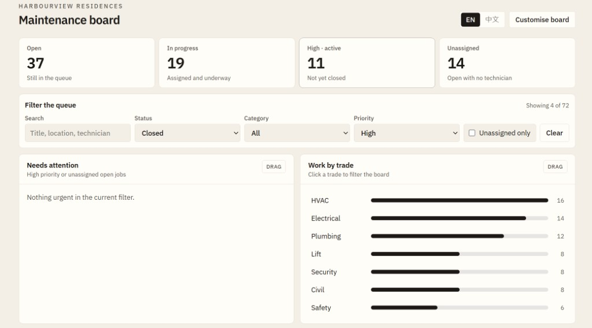
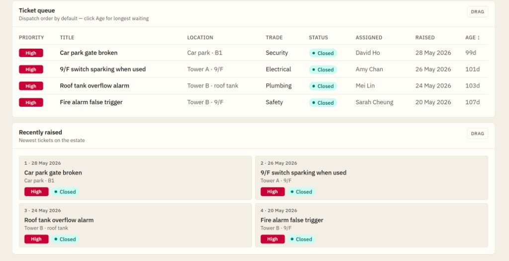
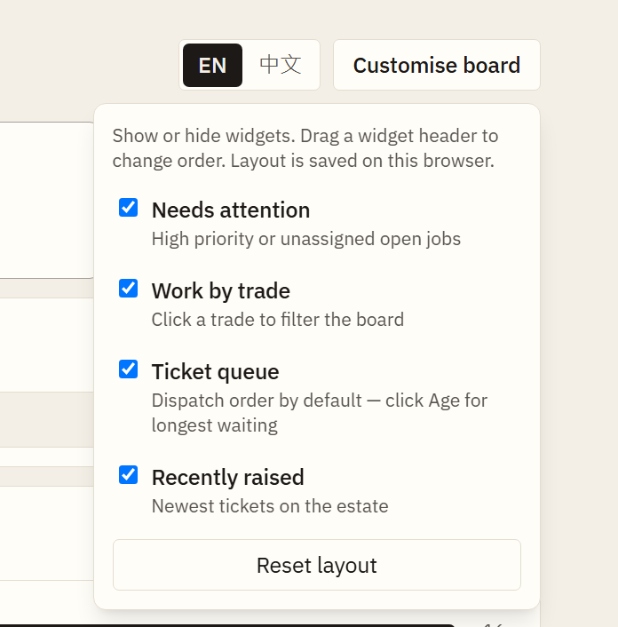

# Maintenance Ticket Dashboard

An operations board for an estate **duty manager / shift coordinator** — the person who has to answer “what is on fire this morning?”

React + Vite frontend, Node/Express API, 72 dummy tickets in JSON. Built for the Butler Asia technical assessment.

## Setup

Node.js 18+.

```bash
npm install
npm run install:all
npm run dev
```

- App: http://localhost:5173 (Vite will use 5174 if 5173 is taken)
- API: http://localhost:3001/api/health

Or run the two apps yourself:

```bash
cd backend && npm install && npm run dev
cd frontend && npm install && npm run dev
```

The Vite dev server proxies `/api` to port 3001.

## Screenshots

KPIs, filters, and trade bars — click a card or a trade to reshape the queue:



Ticket queue (Age column, dispatch sort) and recently raised:



Show, hide, or drag widgets. Layout is saved in this browser:



## Who uses this, and what they need at a glance

Not a resident logging a fault. Someone standing in the management office.

| At a glance | How the board answers it |
| --- | --- |
| How many jobs are still open? | KPI card — click to filter |
| Which High jobs are still live? | KPI counts **High and not closed**; click matches that count |
| Who has not been assigned? | Unassigned KPI + checkbox |
| Which trade is flooding the queue? | Click a bar in **Work by trade** |
| Which ticket has been hanging the longest? | **Age** column (stale = 30+ days, shown in red). Click the header to sort oldest first |
| Can this board fit *my* shift? | Drag widgets, show/hide, saved in the browser. EN / 中文 toggle |

KPIs and trade bars stay **estate-wide** so the numbers do not collapse when you filter. The queue, “needs attention”, and “recently raised” follow the current filters.

## How the problem was approached

1. **Name the user first.** A dispatcher cares about High + Open + unassigned, not about a generic table of 72 rows.
2. **Keep the original 8 samples.** Expand to 72 with a Hong Kong mid-size estate in mind — not random lorem ipsum. High is the minority; closed tickets are older; only Open jobs can be unassigned.
3. **Split HTTP from logic.** `routes/` vs `services/` on the server; `hooks/` vs `components/` on the client.
4. **Filter in the browser.** 72 rows must feel instant. The API still accepts `?status=&category=&priority=` so the same rules can move server-side later.
5. **Widgets, not draggable table columns.** The brief allowed either. A duty manager rearranges *panels* for the shift (attention vs full queue), not column order.
6. **Stop before theatre.** No database, no Redux, no chart library, no i18n framework. JSON + React state + CSS bars + a small language context.

## What you can do

- Filter by status, category, priority, unassigned, or search (title / location / technician)
- Click KPIs and trade bars to toggle the same filters
- Drag widgets; customise what is on the board
- Switch **EN / 中文** — chrome is bilingual; ticket titles stay as logged (typical for a HK estate)
- Default queue sort is dispatch order (High → Open → newest). Click **Age** for longest-waiting first

Widgets: **Needs attention** · **Work by trade** · **Ticket queue** · **Recently raised**

## Code structure

```text
backend/
  data/tickets.json
  scripts/generate-tickets.js
  src/server.js
  src/routes/tickets.js          # HTTP only
  src/services/ticketService.js  # filter + summary
frontend/
  src/components/                # board chrome
  src/components/widgets/        # one file per widget
  src/hooks/                     # data + layout state
  src/i18n/                      # EN / 中文 strings + context
  src/utils/
```

API: `GET /api/tickets`, `GET /api/tickets/summary`, `GET /api/health`.

## Dummy data

`backend/data/tickets.json` — **72** records. Ids 1–8 are the assessment samples, unchanged except `location` and `assignedTo` (the two questions the office always asks).

| Dimension | Shape | Why |
| --- | --- | --- |
| Status | Open 37 · In Progress 19 · Closed 16 | The live queue is what a manager acts on |
| Priority | High 15 · Medium 34 · Low 23 | High stays the minority or nothing is urgent |
| Category | HVAC / Electrical / Plumbing dominate | Day-to-day estate calls |
| Dates | Closed skew older; Open skew recent | A closed alarm from May is plausible |
| Assignee | 14 unassigned, Open only | In Progress / Closed always have an owner |

Regenerate: `node backend/scripts/generate-tickets.js`

## Stack

React 19, Vite 8, Tailwind 4, `@dnd-kit` for widgets, Express 5 reading JSON. Language toggle is a React context, not i18next.
